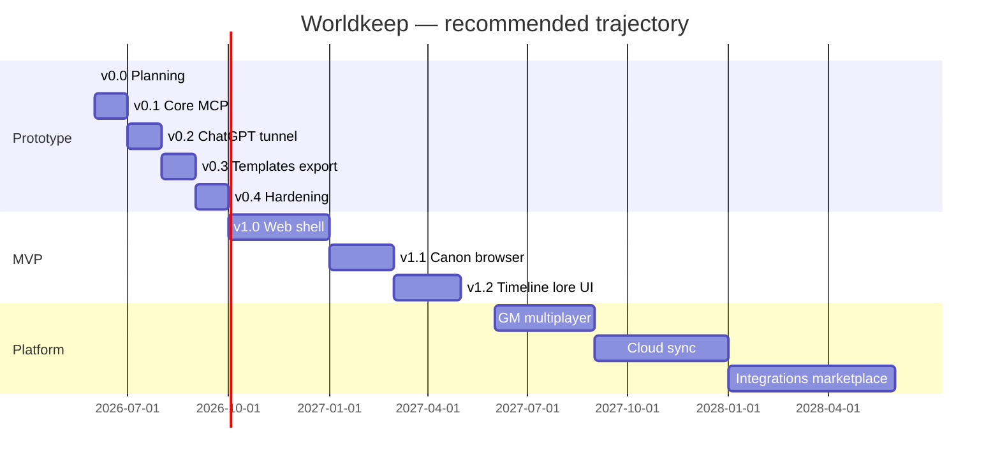

# Full expansion roadmap

Strategic map of **every direction** Worldkeep could grow, with a **recommended timeline**. This doc is **not a work queue** — GitHub issues decide what ships when.

**Horizon key:** *Now* = prototype (`v0.x`), *Next* = MVP (`v1.x`), *Later* = platform (`v2+` / issue-driven).

---

## 1. Core memory engine (foundation)

**What:** SQLite campaign store, MCP tools, scenario bootstrap, scoped reads.

| Capability | Description | Horizon |
|------------|-------------|---------|
| Campaign + premise | `start_campaign(name, premise)` seeds genre tags and opening lore stub | **Now** v0.1 |
| Location graph | Places, exits, `move_to` auto-creates stubs | **Now** v0.1 |
| Entities | NPCs, items, factions, creatures — upsert + `at_location` | **Now** v0.1 |
| Event log | Timestamped "what happened" with links | **Now** v0.1 |
| Lore ledger | Tagged canon entries with importance | **Now** v0.1 |
| Player state | Current location, inventory bag, quest flags JSON | **Now** v0.1 |
| FTS search | `search_world` over names, descriptions, lore | **Now** v0.1–v0.3 |
| Provenance | `source: player \| dm \| inferred` on writes | **Now** v0.3 |
| Merge semantics | Upsert merges fields; never blind overwrite | **Now** v0.1 |

**Why first:** Everything else hangs off durable, queryable canon.

---

## 2. MCP client surfaces

**What:** How LLMs connect to Worldkeep.

| Capability | Description | Horizon |
|------------|-------------|---------|
| stdio MCP | Cursor, Claude Desktop, local agents | **Now** v0.1 |
| Streamable HTTP | ChatGPT remote MCP protocol | **Now** v0.2 |
| Local tunnel | cloudflared / ngrok script + docs | **Now** v0.2 |
| Server instructions | When to read/write; bootstrap requirement | **Now** v0.1 |
| Tool annotations | readOnlyHint, destructiveHint for ChatGPT UX | **Now** v0.2 |
| Self-hosted HTTPS | ECS sidecar pattern (like timelord) | **Next** v1.x |
| OAuth per user | Multi-device cloud campaigns | **Later** |
| Additional clients | Gemini, custom apps via same API | **Later** |

**Recommended path:** Local tunnel validates the play loop **before** infra investment.

---

## 3. Scenario bootstrap & templates

**What:** Dictating the initial world — *"we are Pokémon"* — and optional structured seeds.

| Capability | Description | Horizon |
|------------|-------------|---------|
| Premise dictation | Free-text `premise` on `start_campaign` | **Now** v0.1 |
| Genre tag extraction | LLM or heuristic tags from premise (`pokemon`, `noir`, …) | **Now** v0.3 |
| Template packs | JSON/YAML seeds: default locations, faction stubs, tone hints | **Now** v0.3 |
| Template gallery | Ship 3–5 built-ins: blank, journey, mystery, space opera | **Next** v1.x |
| User-authored templates | Share/import community packs | **Later** |
| Licensed IP modules | **Out of scope** — user premise only; no official Pokémon content | — |

See [scenario-bootstrap.md](./scenario-bootstrap.md) for v0.1 behavior.

---

## 4. Play loop intelligence

**What:** Help the model use memory well without dumping the whole DB.

| Capability | Description | Horizon |
|------------|-------------|---------|
| `get_scene_context` | Location + present entities + recent local events + tagged lore | **Now** v0.1 |
| `get_map` | Exits and discovered subgraph | **Now** v0.3 |
| Importance-ranked lore | Return top-N by tags + recency | **Now** v0.3 |
| Session summary tool | End-of-session narrative digest stored as lore | **Now** v0.4 |
| Contradiction hints | Flag when new write conflicts with stored fact | **Now** v0.4 |
| Embedding retrieval | Semantic search beyond keyword FTS | **Later** |
| Auto-compaction | Summarize old events into lore; archive raw log | **Later** |

---

## 5. Web companion app

**What:** Human-facing UI when you don't want to chat to inspect canon.

| Capability | Description | Horizon |
|------------|-------------|---------|
| Campaign list | Open SQLite campaigns on disk | **Next** v1.0 |
| Location browser | Tree/graph of discovered places | **Next** v1.1 |
| Entity pages | NPC/item detail, edit attributes | **Next** v1.1 |
| Event timeline | Scrollable session history | **Next** v1.2 |
| Lore editor | Manual canon with tags | **Next** v1.2 |
| Map visualization | 2D graph of connections | **Later** v1.x |
| Session replay | Step through events | **Later** |
| Mobile-responsive | Phone glance during table play | **Later** |

**Stack candidates:** Go embed or small React SPA reading same SQLite/API — decide in v1 planning issue.

---

## 6. GM & multiplayer modes

**What:** Tabletop GM prep and player-specific views.

| Capability | Description | Horizon |
|------------|-------------|---------|
| Single-player (default) | One player state, full visibility | **Now** |
| GM hidden lore | `visibility: gm \| player` on lore/entities | **Later** v2 |
| Multiple player records | Party of characters, shared world | **Later** v2 |
| Role-based MCP tools | Player tools can't read GM secrets | **Later** v2 |
| Session prep | "Seed these 5 locations before Friday" | **Later** |
| Live sync | WebSocket push when GM updates canon | **Later** |

---

## 7. Mechanics packs (optional layers)

**What:** Structured game state without replacing the LLM as narrator.

| Capability | Description | Horizon |
|------------|-------------|---------|
| Generic inventory + quests | JSON bags on `player_state` | **Now** v0.1 |
| Custom attributes schema | Per-campaign `mechanics_profile` | **Next** v1.x |
| Dice helper tool | Optional `roll(dice)` — returns raw numbers only | **Later** |
| Stat blocks | HP, skills on entities | **Later** |
| Pack: creature collection | Party, types, badges — **framing only** | **Later** |
| Pack: dungeon crawl | Room states, traps discovered | **Later** |
| Pack: D&D-ish | Classes, spells — data only, no SRD import | **Later** |

**Principle:** Mechanics are **data**; the LLM still narrates. Avoid building a full rules engine in prototype.

---

## 8. Integrations & import/export

| Capability | Description | Horizon |
|------------|-------------|---------|
| Export campaign JSON | Backup and share | **Now** v0.3 |
| Import campaign JSON | Restore | **Now** v0.3 |
| Markdown session log export | For writers | **Next** v1.x |
| World Anvil / Notion import | Spike only | **Later** |
| Obsidian vault sync | Bidirectional lore | **Later** |
| Fiction writing tools | Scrivener, etc. | **Later** |

---

## 9. Platform & cloud

| Capability | Description | Horizon |
|------------|-------------|---------|
| Cloud campaign sync | Encrypted backup | **Later** |
| Accounts + OAuth | Multi-device | **Later** |
| Template marketplace | User-published scenario packs | **Later** |
| Team / org billing | For actual GMs | **Later** |
| Self-host Docker | One-command deploy | **Next** v1.x optional |

---

## 10. AI-adjacent features (careful scope)

| Capability | Description | Horizon |
|------------|-------------|---------|
| Worldkeep stores; LLM narrates | **Core principle** — never auto-narrate inside MCP | **Always** |
| Session summary | LLM-generated, stored as lore via tool | **Now** v0.4 |
| "What do I know about X?" | Search + scene tools only | **Now** |
| Auto-extract entities from chat | **Reject** — writes must be explicit tool calls | — |
| NPC voice consistency sheet | Derived doc for GM; not auto dialogue | **Later** |

---

## Recommended timeline

Assumes part-time maintainer + agent sessions; adjust if full-time.

### Quarter-by-quarter summary

| Period | Focus | Ship signal |
|--------|--------|-------------|
| **2026 Q2** | Planning + v0.1 core | Play in Cursor with stdio MCP; Pokémon premise works |
| **2026 Q3** | v0.2 tunnel + v0.3 templates | Play in ChatGPT through tunnel; export campaign |
| **2026 Q4** | v0.4 hardening | Multi-session playtest without canon drift |
| **2027 H1** | MVP v1.0–v1.2 | Web UI to browse/edit; optional self-host |
| **2027 H2** | GM mode, mechanics packs | Hidden lore; party support |
| **2028+** | Cloud, marketplace, integrations | Issue-driven |

---

## Decision log (early)

| Decision | Choice | Rationale |
|----------|--------|-----------|
| First client | ChatGPT via tunnel | Validates real play; defers ECS/OAuth |
| Storage | SQLite local | Simple, portable, FTS5, matches ideator pattern |
| Language | Go | MCP precedent in timelord; single binary |
| Bootstrap | Required premise string | User must be able to say "we are pokemon" |
| Narration | LLM only | MCP never generates story text |
| IP | User premise only | No shipped Pokémon assets or names as product content |

---

## How to use this doc

1. **Pick the next milestone** from [product-phases.md](./product-phases.md).
2. **Create sub-issues** only for that slice.
3. **Defer** anything in *Later* unless the maintainer explicitly promotes it.

When a section moves from *Later* to *Now*, add a row to [prototype-release-backlog.md](./prototype-release-backlog.md) or open an MVP epic.
