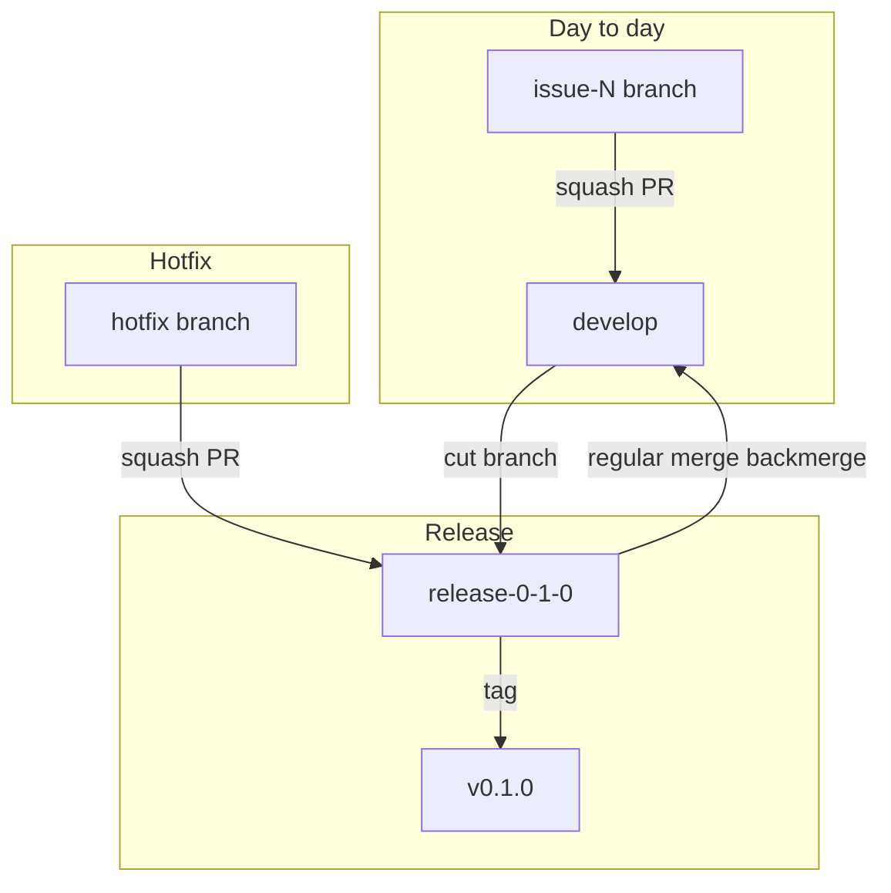
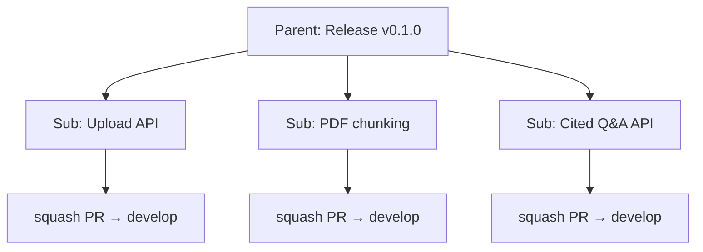

# Issue and PR workflow (reference)

Canonical templates for GitHub issues and pull requests. Agents must follow [AGENTS.md](../../AGENTS.md) **Agent operating model** (planning first, create/manage issues) and **Development workflow**; this doc is the detailed template reference.

**Maintainer gates:** agents **open PRs and ask for review** — they **do not merge** or **cut releases** unless the maintainer explicitly says so.

## Branching and releases

**No `main` or `master`.** Only **`develop`** and **`release-*`** branches.

| Branch | Purpose |
|--------|---------|
| `develop` | Integration — all sub-issue PRs **squash-merge** here |
| `release-X-Y-Z` | Shipped minor (e.g. `release-0-0-0` for `v0.0.0`) — cut from `develop`; hotfixes land here |



### Release flow

1. Sub-issues merge to **`develop`** via **squash** PRs.
2. Test together on **`develop`**.
3. Cut **`release-X-Y-Z`** from `develop` (e.g. `release-0-0-0`).
4. Tag on the **release branch** (e.g. `v0.0.0`).
5. Record tag on the parent issue; close the parent manually when release criteria are met.

**v0.0.0 dry run:** squash-merge planning work to `develop` first; cut `release-0-0-0` later in the dry run.

### Hotfix flow

1. Branch from **`release-X-Y-Z`** (not `develop`).
2. **Squash merge** PR into the release branch.
3. **Regular merge** (backmerge) `release-X-Y-Z` → `develop` so patches are not lost.
4. Tag patch on release branch if needed (`v0.1.1`).

**Rule:** A release branch must **not** remain ahead of `develop` — backmerge after every hotfix.

### Merge methods (required)

| PR type | Base branch | Merge method |
|---------|-------------|--------------|
| Sub-issue / feature | `develop` | **Squash** |
| Hotfix | `release-X-Y-Z` | **Squash** |
| Backmerge | `develop` | **Merge** (regular merge commit) |

---

## Issue hierarchy (required for each minor version)

Every planned minor release (e.g. `v0.1.0`) uses:

1. **One parent issue** — the release milestone.
2. **Multiple sub-issues** — the parts we implement and merge via PRs.



**Rules**

- Create the **parent first**, then sub-issues; link sub-issues to the parent using GitHub **sub-issues**.
- Agents implement **sub-issues only** — one sub-issue per branch/PR.
- **Link every working branch** on the sub-issue (**Development** sidebar).
- PRs to `develop` **squash merge** with **`- Resolves bmsandoval/covered#<sub>`** as the first line (list item — closes sub-issue and unfurls on GitHub).
- **Bug fixes** during testing → **new sub-issue** under the parent (never drive-by on another branch).
- After all subs on `develop`: cut `release-X-Y-Z`, tag, close parent when release criteria are met.

### Labels and milestones (required)

| Item | Milestone | Labels |
|------|-----------|--------|
| Parent release issue | Minor version (`v0.0.0`, `v0.1.0`, …) | `release` |
| Sub-issue | Same as parent | e.g. `documentation`, `planning`, `enhancement`, `prototype`, `stage:0` |
| Pull request | Same as sub-issue | Match sub-issue type labels |

**`prototype` label:** use on `v0.x` release work (alongside `stage:N`). Do not use for future `v1.x` MVP milestones unless maintainer says otherwise.

Create the **milestone first** (one per minor version):

```bash
gh api repos/Bmsandoval/worldkeep/milestones -f title="v0.1.0" -f description="…"
```

Apply when creating or after filing:

```bash
gh issue edit <parent> --milestone "v0.0.0" --add-label "release"
gh issue edit <sub> --milestone "v0.0.0" --add-label "documentation,planning,stage:0"
gh pr edit <pr> --milestone "v0.0.0" --add-label "documentation,planning"
```

**Stage labels:** `stage:0` … `stage:9` aligned with [staged-solution-plan.md](./staged-solution-plan.md).

### Link branch and PR (Development section)

**Before feature commits** (required):

```bash
git checkout develop && git pull
gh issue develop <issue-number> --name issue-<issue-number>-<short-slug> --checkout --base develop
git commit --allow-empty -m "Start issue-<issue-number>-<short-slug>"
git push -u origin HEAD
# implement, commit, push, open PR
```

The **empty commit** is optional but recommended when you need the linked remote branch and Development panel set up **before** real work.

**Auto-named branches:** Do not use GraphQL `createLinkedBranch`. GitHub may create `3-add-…` from the issue title — that branch is **not** yours. After squash-merge to `develop`, delete it; do not merge it (it only looks “ahead” with obsolete commits).

**Branch already on remote without link:** sub-issue → **Development** → **Link a branch** → `issue-<N>-<slug>`.

**After PR merge:** delete stale `issue-<N>-*` and any mistaken `N-add-…` remote branches.

**PR first line (required):**

```text
- Resolves bmsandoval/covered#<sub>
```

Must be a **list item** (`-` prefix) so GitHub **unfurls** the issue (title + state) and applies the closing keyword on squash-merge. No full issue URL or extra `- #<sub>` line.

Squash-merge to `develop` closes the **sub-issue**. The **parent** is tracked via GitHub **sub-issue** relationships; GitHub may auto-close the parent when all subs close — still comment with tag/branch when releasing. Link branch/PR on the **sub-issue** Development panel (no parent/PR/planning links needed in issue bodies).

**Parent release issues** do not get feature branches — only **sub-issues** do.

---

## Writing conventions (issues vs branches vs PRs)

Each artifact has a different job. **Do not copy the same sentence** into the issue title, branch name, PR title, and PR body — link them via issue number and `Development`, not duplication.

### What each artifact is for

| Artifact | Audience | Voice | Put here | Do not put here |
|----------|----------|-------|----------|-----------------|
| **Parent issue title** | Maintainers, planning | Outcome / release theme | User-visible capability for the minor version | Implementation tasks, file paths, branch names |
| **Parent issue body** | Same | **Why** for users (epic) | User stories, release checklist, tag/branch metadata | Step-by-step dev tasks, PR links, planning doc URLs |
| **Sub-issue title** | Same | **Short user need** (≤ ~72 chars) | What the user gains, not how we build it | `Add API`, class names, `issue-12-…` |
| **Sub-issue body** | Same | **Contract** for the slice | User story, testable acceptance criteria, out of scope | Code design, commit list, duplicate of PR |
| **Branch name** | Git / CI | **Technical slug** | `issue-<N>-<kebab-slug>` (3–5 words, ASCII, lowercase) | Full user story, spaces, `Release v0.1.0` |
| **PR title** | Reviewers | **Engineering change** | `Issue-<N> - <what this PR does technically>` | User story preamble, milestone name only |
| **PR body** | Reviewers | **What shipped in code** | Resolves line, problem/approach, file-level changes, test plan | Full user story, copy-pasted acceptance criteria |

### User stories (parent and sub-issues)

Use the standard form in the **issue body** (not necessarily in the title):

```text
As a <persona>, I want <goal>, so that <benefit>.
```

**Personas for Worldkeep**

| Persona | Use when |
|---------|----------|
| **policyholder** | Prototype/MVP insurance features (upload, Q&A, citations) |
| **contributor** | Repo, CI, docs, agent workflow, release process |
| **maintainer** | Optional alias for internal tooling; prefer **contributor** for consistency |

**Parent (epic) vs sub-issue (slice)**

| Level | Story scope | Title style |
|-------|-------------|-------------|
| **Parent** | Outcome for the **whole minor version** — one or two stories in the body, plus release criteria | `Release v0.1.0 — <user-facing theme>` e.g. `Release v0.1.0 — Ask My Insurance Plan` |
| **Sub-issue** | **One** negotiable slice a single PR can finish | Short **need**, not implementation: e.g. `Upload insurance PDFs for cited Q&A` not `Add POST /documents` |

**Good sub-issue title (need):** `Upload insurance PDFs for cited Q&A`  
**Weak (implementation):** `Add PDF upload endpoint` — save that phrasing for the **PR title**.

**Acceptance criteria** — testable from the user’s perspective (or contributor perspective for stage-0 work), not “merge PR” alone:

- Good: `Given an SBC PDF, when I upload it, then it appears in my document list with filename and upload time.`
- Weak: `Implement upload handler` (belongs in PR **Changes**, not the issue).

**Bugs** — still a user story when it affects product behavior; title can state the defect in plain language:

- Title: `Specialist copay answer cites wrong page`
- Story: `As a policyholder, I want copay answers to cite the correct page in my SBC, so that I can verify them with my insurer.`

### Branch names

Pattern: `issue-<number>-<slug>`

- **Slug** = kebab-case hint of the **technical** work (for `git branch`, CI, Development link).
- Derive from the sub-issue, but **shorter and more technical** than the issue title.
- Examples:

| Sub-issue title (user need) | Branch slug |
|----------------------------|-------------|
| Upload insurance PDFs for cited Q&A | `issue-15-pdf-upload` |
| Add planning documents and workflow to repository | `issue-3-planning-docs` |

### PR titles and bodies

- **Title:** `Issue-<N> - <engineering summary>` — OK to name endpoints, modules, or doc paths here.
- **Body:** Assume the reader can open the linked issue for the user story. **Summary** = what was wrong / what we did in engineering terms; **Changes** = bullets tied to files or subsystems; **Test plan** = how a reviewer verifies (commands, manual steps).

Do **not** repeat `As a … I want …` in the PR body.

### Minimal example (same work, four surfaces)

| Surface | Example |
|---------|---------|
| Sub-issue title | Upload insurance PDFs for cited Q&A |
| Sub-issue body | As a **policyholder**, I want to upload SBC/EOC PDFs, so that I can ask coverage questions against my real plan. AC: … |
| Branch | `issue-15-pdf-upload` |
| PR title | `Issue-15 - Add PDF upload endpoint and document record` |
| PR body | `- Resolves bmsandoval/covered#15` + Summary / Changes / Test plan (engineering) |

---

## Release parent issue template

**Title:** `Release v0.1.0 — Prototype: <theme>` (e.g. `Release v0.1.0 — Prototype: document upload`)

Milestone description should start with `Prototype:` — see [product-phases.md](./product-phases.md). Avoid “MVP” in `v0.x` titles.

```markdown
## Summary

One paragraph: what this minor version delivers **for users** (not how we build it).

## User stories

As a <persona>, I want <goal>, so that <benefit>.

_Add more bullets only if the release truly has multiple distinct outcomes._

## Target tag

`v0.1.0`

## Release branch

`release-0-1-0` (cut from `develop` after sub-issues merge and test)

## Sub-issues

- [ ] #__ — <title>

## Release acceptance criteria

- [ ] All sub-issues closed (squash-merged to `develop`)
- [ ] Tested on `develop`
- [ ] `release-0-1-0` cut from `develop` and pushed
- [ ] Tag `v0.1.0` on release branch and pushed
- [ ] Tag recorded on this issue

## Test plan (release batch)

- [ ] …
```

---

## Sub-issue template

**Title:** Short **user need** — e.g. `Upload insurance PDFs for cited Q&A` (not `Add PDF upload endpoint`)

```markdown
## User story

As a <persona>, I want <goal>, so that <benefit>.

## Context

_Optional: why now, constraint, or link to stage — keep brief._

## Acceptance criteria

- [ ] _Testable, user-visible (Given/When/Then or clear checklist)_
- [ ] …

## Out of scope

- …
```

Link the sub-issue to its parent in GitHub (**sub-issues** under the parent). Do not repeat parent/PR/planning links in the body — the **Development** panel shows the linked branch and PR.

---

## Pull request template

**Branch name:** `issue-<number>-<kebab-slug>` — technical, 3–5 words (see **Writing conventions**)

**PR title:** `Issue-<number> - <engineering summary>` — what this PR does in code/docs (may differ from issue title)

**Base branch:** `develop` (features) or `release-X-Y-Z` (hotfixes only)

**Merge:** **Squash** (features and hotfixes); **regular merge** for backmerge PRs only.

```markdown
- Resolves bmsandoval/covered#<sub>

## Summary

<Engineering problem in 1–2 sentences — do not repeat the issue user story.>

<Approach in 1–2 sentences.>

## Changes

- …

## Test plan

- [ ] …
```

---

## No tool branding

Do **not** include “Made with Cursor”, “AI-generated”, or similar in issues, PRs, commits, or release notes. **Remove** any Cursor footer GitHub appends before merge. See [AGENTS.md](../../AGENTS.md).

---

## Linking checklist

**When creating a minor version**

- [ ] Milestone created (e.g. `v0.0.0`)
- [ ] Parent issue + milestone + `release` label
- [ ] Sub-issues linked as sub-issues of parent; same milestone + labels

**When starting work (sub-issue)**

- [ ] Linked branch on **Development** (`gh issue develop` or manual link)
- [ ] Branch from `develop`

**When opening a PR (sub-issue)**

- [ ] Base: **`develop`**
- [ ] Merge method: **squash** (when maintainer merges)
- [ ] First line: `- Resolves bmsandoval/covered#<sub>`
- [ ] No Cursor / “Made with” footer in PR body
- [ ] Backlink on sub-issue; PR under **Development**
- [ ] Milestone and labels on PR
- [ ] **Tell maintainer PR is ready; ask for review — do not `gh pr merge`**

**When releasing (maintainer only — agent may recommend, not execute)**

- [ ] Maintainer explicitly approved cut/tag
- [ ] Correct version: patch `v0.0.x` vs minor `v0.x.0`

**When releasing**

- [ ] All sub-issues squash-merged to `develop`
- [ ] Test on `develop`
- [ ] Cut `release-X-Y-Z` from `develop`
- [ ] Tag on release branch; close parent when release criteria are met

**When hotfixing a release**

- [ ] PR into `release-X-Y-Z` — squash merge
- [ ] Backmerge `release-X-Y-Z` → `develop` — **regular merge**
- [ ] Release branch not left ahead of `develop`
